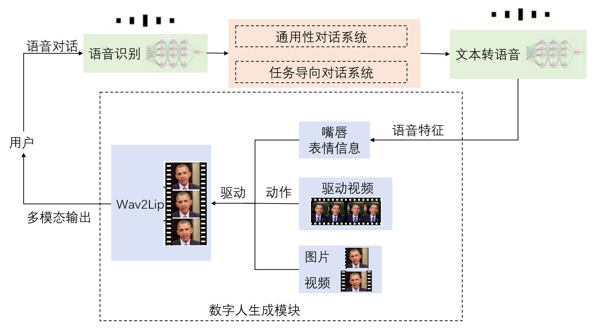

#  “数字人交互，与虚拟的自己互动”——用PaddleAvatar打造数字分身，探索人机交互的未来


你是否曾经幻想过与自己的虚拟人交互？现在，使用`PaddleAvatar`，您可以将自己的图像、音频和视频转化为一个逼真的数字人视频，与其进行人机交互。

`PaddleAvatar`是一种基于**PaddlePaddle**深度学习框架的数字人生成工具，基于Paddle的许多套件，它可以将您的数字图像、音频和视频合成为一个逼真的数字人视频。除此之外，`PaddleAvatar`还支持进一步的开发，例如使用自然语言处理技术，将数字人视频转化为一个完整的人机交互系统，使得您能够与虚拟的自己进行真实的对话和互动。

使用`PaddleAvatar`，您可以将数字人视频用于各种场合，例如游戏、教育、虚拟现实等等。P`addleAvatar`为您提供了一个自由创作的数字世界，让您的想象力得到了充分的释放！

所以，现在就使用`PaddleAvatar`，打造自己的数字分身，探索人机交互的未来吧！


## 🪀 环境说明

- Anaconda 
- Python 3.8 
- paddlepaddle 


## ⚙️ 1. 安装环境

我们需要安装paddlepaddle环境，环境的安装，可以看这里[paddlepaddle安装](https://www.paddlepaddle.org.cn/install/quick?docurl=/documentation/docs/zh/install/pip/windows-pip.html)，我自己安装的版本是2.3.2，应该2.4也是能正常运行的

```bash
conda install paddlepaddle-gpu==2.3.2 cudatoolkit=11.2 -c https://mirrors.tuna.tsinghua.edu.cn/anaconda/cloud/Paddle/ -c conda-forge
```


安装了paddlepaddle以后，可以安装所需要和对应的库，我已经写入requirements.txt中了

```python
pip install -r requirements.txt
```


## 😀 2.PaddleAvator技术原理


## 🔮 3.网页部署（Streamlit）

这里可以使用`streamlit`进行网页端的部署，这样就利用可视化进行体验，这里可以看到有一个8501的端口，打开来即可看到网页

```bash
streamlit run avatar.streamlit.py
```


对于TTS，文字转语音来说，我设置了两种方式

- PaddleSpeech语音合成，可选择多种声音和语调，可以调节语言和人
- Azure微软语音合成，调用微软的API进行语音合成，不过需要填入密钥（这里不提供）


## 🔥 4.未来展望（人机交互）

我设计了一个基于自然语言处理、语音和图像处理等人工智能技术的人机交互系统。该系统致力于实现高度逼真的数字人多模态交互，以提供更加自然和亲密的用户体验。如图所示，该系统由四个核心模块组成：

(1) `自动语音识别(ASR)模块`，用于将用户的语音输入转化为文本信息。

(2) `对话系统(DS)`，用于接收ASR模块输出的文本信息，并进行对话处理。

(3) `文本到语音(TTS)模块`，用于将DS模块输出的文本信息转化为高度逼真的语音信息。

(4) `数字人生成模块`，用于预处理模型输入的图片和视频，以提取面部特征。接下来，该模型利用TTS模块将低维语音信号映射到高维视频信号，包括嘴巴、表情和动作等。最后，该模型使用神经网络来融合特征和多模态输出视频，并将其在客户端上显示。




## 🎯 TO DO LIST

在本仓库之中，已经实现了第3和第4个模块，但是离完整的人机交互系统差一部分，所以这一部分还可以继续努力

- [x] 加入表情迁移（丰富头部动作信息）
- [ ] 实时语音识别（人与数字人之间就可以通过语音进行对话交流)
- [ ] 语音克隆技术（语音克隆合成自己声音，提高数字人分身的真实感和互动体验）
- [ ] 类GPT对话系统（提高数字人的交互性和真实感，增强数字人的智能）


## 📑 参考资料

- https://github.com/JiehangXie/PaddleBoBo
- https://github.com/PaddlePaddle/PaddleSpeech
- https://github.com/PaddlePaddle/PaddleGAN
